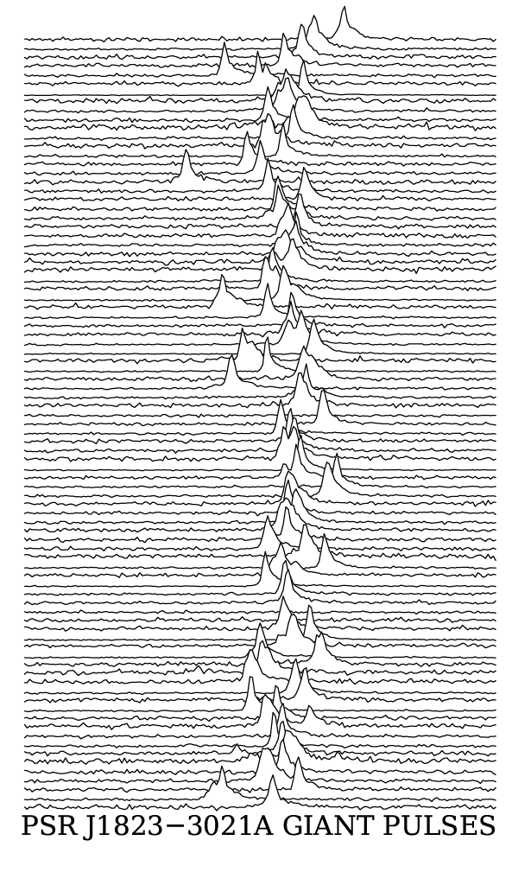
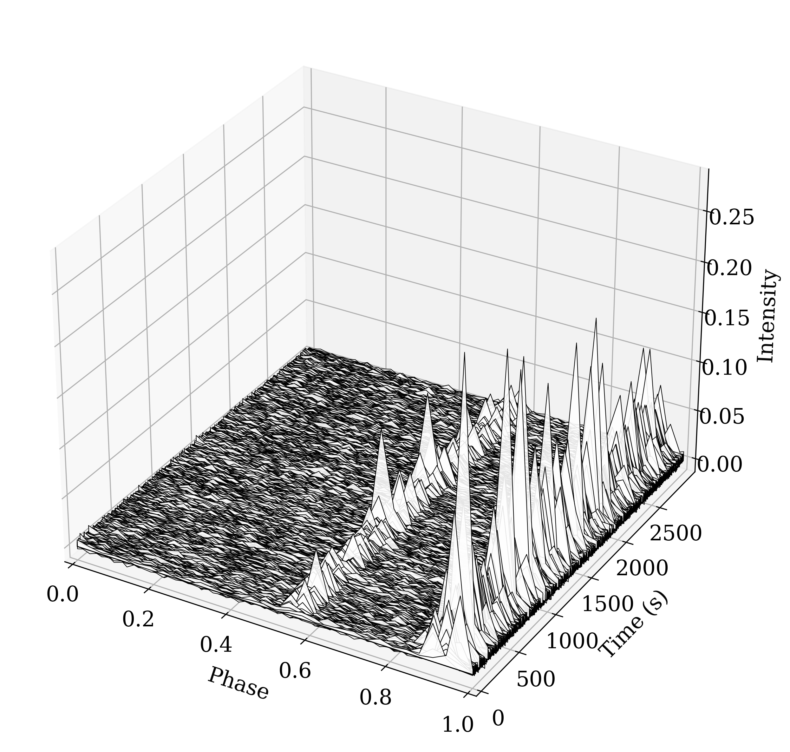

# Giant Pulses Visualization

Tools for visualizing pulsar giant pulse profiles from PSRCHIVE archive files.

---

## Scripts

### `plot_joydivision_style.py` — Joy Division / Unknown Pleasures Style

Stacks normalized pulse profiles in the iconic Joy Division *Unknown Pleasures* style — white lines on a (optionally) dark background, with optional horizontal color gradients.



#### Usage

```bash
# Basic: plot first 50 pulses
./plot_joydivision_style.py xprof.pdmp.giants.catalog -n 50

# With SNR threshold and custom amplitude/spacing
./plot_joydivision_style.py xprof.pdmp.giants.catalog -s 15 -v 2.0 -l 0.8

# Focus on a phase window (e.g. main pulse only)
./plot_joydivision_style.py xprof.pdmp.giants.catalog -n 100 --phase-min 0.3 --phase-max 0.7

# Enable horizontal colour gradient (black → white by default)
./plot_joydivision_style.py xprof.pdmp.giants.catalog -n 100 --gradient

# Custom gradient colours
./plot_joydivision_style.py xprof.pdmp.giants.catalog -n 100 --gradient --gradient-colors purple white orange
```

#### Options

| Flag | Default | Description |
|------|---------|-------------|
| `catalog` | — | Path to catalog file (required) |
| `-o`, `--output` | `giant_pulses_joydivision.png` | Output filename |
| `-n`, `--max-pulses` | all | Maximum number of pulses to plot |
| `-dt`, `--downsample-time` | 1 | Plot every Nth pulse |
| `-dp`, `--downsample-phase` | 1 | Average every N phase bins |
| `-s`, `--snr-threshold` | None | Minimum SNR to include |
| `--width-min` | None | Minimum pulse width (ms) |
| `--width-max` | None | Maximum pulse width (ms) |
| `-v`, `--vertical-scale` | 1.0 | Amplitude scale factor |
| `-l`, `--line-spacing` | 1.0 | Vertical spacing between lines |
| `--phase-min` | 0.0 | Start of phase window |
| `--phase-max` | 1.0 | End of phase window |
| `--gradient` / `--no-gradient` | gradient on | Horizontal colour gradient |
| `--gradient-colors` | black white | Space-separated gradient colours |

---

### `plot_giant_pulses_3d.py` — 3D Waterfall Plot

Creates a 3D perspective waterfall of pulse profiles stacked in time, rendered as white polygons with black outlines.



#### Usage

```bash
# Basic usage
./plot_giant_pulses_3d.py xprof.pdmp.giants.catalog

# Limit pulses, set viewing angle
./plot_giant_pulses_3d.py xprof.pdmp.giants.catalog -n 100 --elevation 25 --azimuth -45

# With SNR filter and phase downsampling
./plot_giant_pulses_3d.py xprof.pdmp.giants.catalog -s 12 -dp 4

# Save to custom file
./plot_giant_pulses_3d.py xprof.pdmp.giants.catalog -o my_waterfall.png
```

#### Options

| Flag | Default | Description |
|------|---------|-------------|
| `catalog` | — | Path to catalog file (required) |
| `-o`, `--output` | `giant_pulses_3d.png` | Output filename |
| `-n`, `--max-pulses` | all | Maximum number of pulses to plot |
| `--no-normalize` | normalize on | Disable per-profile normalization |
| `--elevation` | 30 | 3D view elevation angle (degrees) |
| `--azimuth` | -60 | 3D view azimuth angle (degrees) |
| `-dt`, `--downsample-time` | 1 | Plot every Nth pulse |
| `-dp`, `--downsample-phase` | 1 | Average every N phase bins |
| `-s`, `--snr-threshold` | None | Minimum SNR to include |

---

## Catalog Format

Both scripts expect a whitespace-delimited catalog file (comments lines beginning with `#` are ignored). A typical row looks like:

```
# filename                          toa_xprof       snr_xprof  width_ms  time_s
/data/pulses/gp_0001.zapp           53001.000123456  45.3       2.14      0.0
/data/pulses/gp_0002.zapp           53001.000234567  31.7       1.87      1.2
```

| Column | Used by | Description |
|--------|---------|-------------|
| `filename` | both | Absolute or relative path to the `.zapp` PSRCHIVE archive for this pulse |
| `toa_xprof` | Joy Division | Time of arrival from cross-profile fit (MJD) — used as the time axis label |
| `snr_xprof` | both | Signal-to-noise ratio from cross-profile fit — used for `--snr-threshold` filtering |
| `width_ms` | Joy Division | Pulse width in milliseconds — used for `--width-min` / `--width-max` filtering |
| `time_s` | 3D waterfall | Pulse arrival time in seconds (e.g. relative to observation start) — used as the 3D y-axis |

> **Note:** Additional columns in the catalog are ignored, so it is safe to include extra metadata columns.

---

## Installation

```bash
pip install numpy matplotlib pandas
```

[PSRCHIVE](http://psrchive.sourceforge.net/) must be installed and its Python bindings available:

```python
import psrchive  # should work without error
```

---

## Requirements

See [`requirements.txt`](requirements.txt) for the full Python dependency list.

---

## License

MIT
